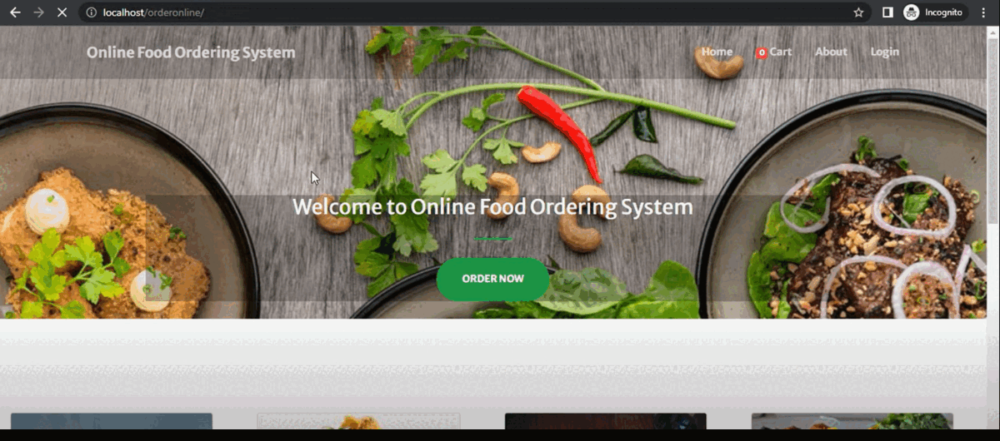

# Online_Food_Delivery_Website
## About the project
The Simple Online Food Ordering System has the admin side and visitor/client-side. The admin will manage all the data needed for the website more importantly the list of available menus. The client will browse the website, explore and choose his/her desired menu's and save it to cart for later checkout. After that, the client will go to the cart, review his/ her order, confirm the delivery address and other information, and place his/ her order. 
## Demo

## Features
### Admin Side
#### Login Page
The page where the admin will input his or her credential to access the admin side of the system.
#### Category Page
The page where all product/menu categories are listed and being managed by admin.
#### Menu Page
The page where the product/menu is listed and can be managed by the admin.
#### System Settings
The page where an admin configures the website data.
### Client-Side
#### Home Page
The Page where the client will be redirected by default and can choose his/her desired menus.
#### Cart Page
The page where the list of menu's/product that being saved cart is listed.
#### Checkout Page
The page where the client will place his/her order.
